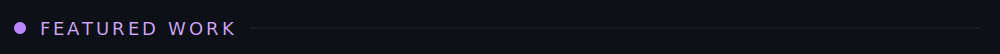
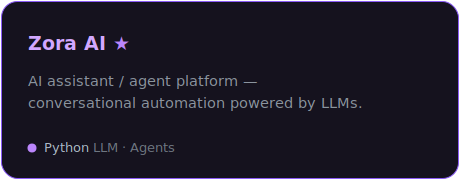
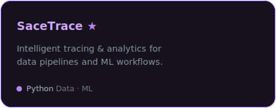

 

  

### 🟣 Stack

  

  

<!-- Invisible tracker: keeps the komarev view count incrementing on every profile visit.
     The workflow in .github/workflows/profile-views.yml reads this count every 6h and
     regenerates assets/profile-views.svg. Do not remove. -->

